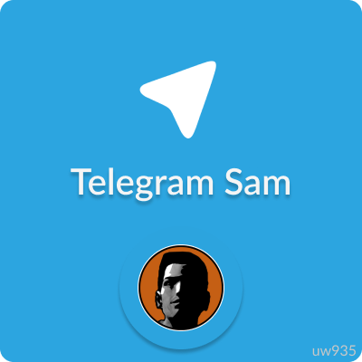

<br>
<p align="center">
  
  <h3 align="center">Telegram Sam v1.0.0</h3>
  <p align="center">Simple Multi Theft Auto Lua library for <a href="https://core.telegram.org/bots/api">Telegram Bot API</a><p>
</p>
<br> 

## Documentation

## Getting started
This library was tested with MTA <b>1.5.9</b>. But minimum MTA version is <b>1.5.3</b>. 
Library use longpoll to receive telegram updates. Does not even overload the server. 

To install library:

1. You can just donwload "telegramsam" folder in this repository
2. Then put this folder to your resources
3. Important: Add resource "telegramsam" to ACL and give it RPC rights: (it need to fetchRemote correctly work)

```xml
    <group name="RPC">
        <acl name="RPC"></acl>
        <object name="resource.telegramsam"></object>
    </group>
```

## Usage
### Preparing
For this, you must create your bot using <a href="https://t.me/BotFather">Bot Father</a> and copy bot token.

### Writing first bot 
Let's write simple echo bot

**Important note**: if you want to restart some resource that using telegramsam, so you must restart all resources that use it too. For example, i have 2 resource using telegramsam, and i want to restart 1 of them. So first i need to restart telegramsam, and then restart all of these 2 resources.

1. Create your resource, for example it will called "mytelegrambot"
2. Create file "server.lua"
3. Add meta.xml
4. Resource "telergamsam" must be running before we start our resource.

```Lua
local Bot = exports["telegramsam"]:BotLogin(getResourceName(getThisResource()), "yourtokenhere"))
```

First we login our bot and registr resource in library. Local variable Bot will receive table. Table contain our ***key***. By this ***key*** we will contact with library. More about [BotLogin](https://github.com/uw935/mta-telegram-sam/blob/master/docs/docs_main.md#botlogin)

```Lua
function Bot:SendRequest(requestName, ...)
  return exports["telegramsam"]:BotSendRequest(self.key, requestName, ...)
end
```

We create function called SendRequest in Bot table. Using this function we will contact with library and make easier to call library functions.

```Lua
local function MessageHandler(message)
  
end
addEventHandler("onTelegramNewMessage", root, MessageHandler)
```

In this part, we create local function MessageHandler and add it to event handler called ["onTelegramNewMessage"](https://github.com/uw935/mta-telegram-sam/blob/master/docs/docs_main.md#ontelegramnewmessage).

```Lua
local function MessageHandler(message)
  Bot:SendRequest("SendMessage", message.chat.id, message.text)
end
addEventHandler("onTelegramNewMessage", root, MessageHandler)
```

We just add one line to MessageHandler function. This line will send user message, requesting library for send message with [SendMessage](https://github.com/uw935/mta-telegram-sam/blob/master/docs/docs_functions.md#sendmessage) args, such as chat id and text.
Here we are! Echo bot created. Total code will looks like this:

```Lua
local Bot = exports["telegramsam"]:BotLogin(getResourceName(getThisResource()), "yourtokenhere")

function Bot:SendRequest(requestName, ...)
  return exports["telegramsam"]:BotSendRequest(self.key, requestName, ...)
end

local function MessageHandler(message)
  Bot:SendRequest("SendMessage", message.chat.id, message.text)
end

addEventHandler("onTelegramNewMessage", root, MessageHandler)
```

Then we can start our resource, wait until "Successfully connected as ...", after that we can write something to our telegram bot. Profit!


## More examples

+ <a href="https://github.com/uw935/mta-telegram-sam/tree/master/examples/keyboard">Work with keyboard: reply and callback</a>
+ <a href="https://github.com/uw935/mta-telegram-sam/tree/master/examples/functions">Simple bot examples, that using Telegram Sam functions</a>
+ <a href="https://github.com/uw935/mta-telegram-sam/tree/master/examples/simple_bot">Simple bot example</a>

## More docs
+ <a href="https://github.com/uw935/mta-telegram-sam/blob/master/docs/docs_functions.md">About functions and event</a>
+ <a href="https://github.com/uw935/mta-telegram-sam/blob/master/docs/docs_keyboards.md">About keyboards</a>
+ <a href="https://github.com/uw935/mta-telegram-sam/blob/master/docs/docs_main.md">Main documentation</a>

## In progress:

1. Add more telegram API functions
2. Work with chat
3. Work with channels

## Creators

Made by @uw935
