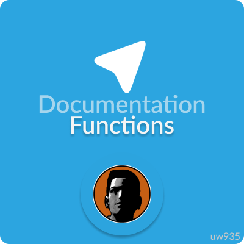

<p align="center">
  
  <h3 align="center">Telegram Sam v1.0.0</h3>
  <p align="center">Simple Multi Theft Auto Lua library for <a href="https://core.telegram.org/bots/api">Telegram Bot API</a><p>
</p>

<br>

## Library functions
Note
+ Type of return argument ***callback*** means that you can get it only through callback event (onTelegramCallbackReceive), also to get it you must to pass response_data in function arguments.
## SendMessage 
This function send message to some chat id. 
### Syntax 
```
  callback SendMessage( string key, number chat_id, string text, [ number reply_markup, boolean disable_notification, number reply_to_message_id, boolean disable_web_page_preview, table response_data ] )
```
### Arguments
+ key: a key from [BotLogin](https://github.com/uw935/mta-telegram-sam/blob/master/docs/docs_main.md#botlogin)</a> table
+ reply_markup: index of keyboard that you can get by [InitKeyboard](https://github.com/uw935/mta-telegram-sam/blob/master/docs/docs_keyboards.md#initkeyboard)
+ response_data: a table with which you can pass various information that will be returned in callback_data, **without this table it wont return anything at callback**
+ chat_id, text, disable_notification, reply_to_message_id, disable_web_page_preview: https://core.telegram.org/bots/api#sendmessage
### Returns
Returns [Telegram message type](https://core.telegram.org/bots/api#message) at callback event on success (for this you must pass table response_data in function)
### Examples
1. This example sends message that user will write to the bot and then if it success print it with callback_data

```Lua
function Bot:SendRequest(functionName, ...)
  return exports["telegramsam"]:BotSendRequest(self.key, functionName, ...)
end

addEventHandler("onTelegramCallbackReceive", root, function(cData)
  if cData.callback_data.data_id == "mydataid" then
    print("Message with text "..cData.text.." sent!")
  end
end)

addEventHandler("onTelegramNewMessage", root, function(message)
  Bot:SendRequest("SendMessage", message.chat.id, message.text, false, false, false, false, {data_id="mydataid"})
end)
```


2. This example sends information message whenever player connect to the server

```Lua
local admin_chat_id = 111

function Bot:SendRequest(functionName, ...)
  return exports["telegramsam"]:BotSendRequest(self.key, functionName, ...)
end

addEventHandler("onPlayerJoin", root, function(cData)
  Bot:SendRequest("SendMessage", admin_chat_id, "Player with name " ..getPlayerName(source).." connected!")
end)
```


<br>

## DeleteMessage
This function deletes the message whose message_id you will pass to function
### Syntax
```
  callback DeleteMessage( string key, number chat_id, number message_id, [ table response_data ] ) 
```
### Arguments 
+ key: a key from [BotLogin](https://github.com/uw935/mta-telegram-sam/blob/master/docs/docs_main.md#botlogin)</a> table
+ chat_id, message_id: https://core.telegram.org/bots/api#deletemessage
+ response_data: a table with which you can pass various information that will be returned in callback_data, **without this table it wont return anything at callback**
### Returns 
Returns execution status in "status" index of callback data table (for this you must pass table response_data in function)
### Examples
This example delete sent message and prints to console that message was deleted

```Lua
function Bot:SendRequest(functionName, ...)
    return exports["telegramsam"]:BotSendRequest(self.key, functionName, ...)
end
  
addEventHandler("onTelegramCallbackReceive", root, function(cData)
  if cData.callback_data.data_id == "deletemymessage" then 
    Bot:SendRequest("DeleteMessage", cData.chat.id, cData.message_id, {data_id="messagedeleted"})
  elseif cData.callback_data.data_id == "messagedeleted" then 
    print("message deleted")
  end

end)

addEventHandler("onTelegramNewMessage", root, function(message)
  Bot:SendRequest("SendMessage", message.chat.id, message.text, false, false, false, false, {data_id="deletemymessage"})
end)
```


<br>

## SendPhoto
This function send photo to user
### Syntax
```
  callback SendPhoto( string key, number chat_id, string photo, [ string caption, number reply_markup, number reply_to_message_id, table response_data] )
```
### Arguments
+ key: a key from [BotLogin](https://github.com/uw935/mta-telegram-sam/blob/master/docs/docs_main.md#botlogin)</a> table
+ chat_id, caption, reply_to_message_id: https://core.telegram.org/bots/api#sendPhoto
+ photo: link to a photo 
+ reply_markup: index of keyboard that you can get by [InitKeyboard](https://github.com/uw935/mta-telegram-sam/blob/master/docs/docs_keyboards.md#initkeyboard)
+ response_data: a table with which you can pass various information that will be returned in callback_data, **without this table it wont return anything at callback**
### Returns
Returns [Telegram message type](https://core.telegram.org/bots/api#message) at callback event on success (for this you must pass table response_data in function)
### Example
This example sends photo to the user messsage
```Lua
function Bot:SendRequest(functionName, ...)
  return exports["telegramsam"]:BotSendRequest(self.key, functionName, ...)
end

addEventHandler("onTelegramNewMessage", root, function(message)
  Bot:SendRequest("SendPhoto", message.chat.id, "https://krot.info/uploads/posts/2021-12/1638467709_46-krot-info-p-peizazhi-prirodi-rossii-krasivie-foto-49.jpg", false, false, message.message_id)
end)
```


<br>

## EditMessage
This function edit message by its message_id
### Syntax
```
  callback EditMessage( string key, number chat_id, number message_id, string text, [ boolean caption, table response_data ] )
```
### Arguments 
+ key: a key from [BotLogin](https://github.com/uw935/mta-telegram-sam/blob/master/docs/docs_main.md#botlogin)</a> table
+ chat_id, text, message_id: https://core.telegram.org/bots/api#editmessagetext
+ caption: set to true if you need to edit caption (on photo messages)
+ response_data: a table with which you can pass various information that will be returned in callback_data, **without this table it wont return anything at callback**
### Returns
Returns [Telegram message type](https://core.telegram.org/bots/api#message) at callback event on success (for this you must pass table response_data in function)
### Example
This example edits message whenever player quit from server (onPlayerQuit)
```Lua
local admin_id = 815371016
local message_id = nil 

function Bot:SendRequest(functionName, ...)
  return exports["telegramsam"]:BotSendRequest(self.key, functionName, ...)
end

Bot:SendRequest("SendMessage", 815371016, "This message will edited", false, false, false, false, {id="editmessage"})

addEventHandler("onTelegramCallbackReceive", root, function(callbackData)
  if callbackData.callback_data.id == "editmessage" then 
    message_id = callbackData.message_id
  end
end)

addEventHandler("onPlayerQuit", root, function()
  if not message_id then return end 
  Bot:SendRequest("EditMessage", admin_id, message_id, "Player with nickname "..getPlayerName(source).." has quit for some reason")
end)
```


<br>

## EditMessageReplyMarkup
This function edits message reply markup 
### Syntax
```
  EditMessageReplyMarkup( string key, number chat_id, number message_id, number reply_markup, [ table response_data ] )
```
### Arguments
+ key: a key from [BotLogin](https://github.com/uw935/mta-telegram-sam/blob/master/docs/docs_main.md#botlogin)</a> table
+ chat_id, message_id: https://core.telegram.org/bots/api#editmessagereplymarkup
+ reply_markup: index of keyboard that you can get by [InitKeyboard](https://github.com/uw935/mta-telegram-sam/blob/master/docs/docs_keyboards.md#initkeyboard)
+ response_data: a table with which you can pass various information that will be returned in callback_data, **without this table it wont return anything at callback**
### Returns 
Returns Telegram edited [message](https://core.telegram.org/bots/api#message) at callback event on success (for this you must pass table response_data in function)
### Examples
This example changes message inline keyboard by clicking on button

```Lua
function Bot:SendRequest(reqName, ...)  
    return exports["telegramsam"]:BotSendRequest(self.key, reqName, ...)
end

local MyFirstKeyboard = Bot:SendRequest("InitKeyboard", "firstkb", true)
local MySecondKeyboard = Bot:SendRequest("InitKeyboard", "secondkb", true)


Bot:SendRequest("AddRow", MyFirstKeyboard, {{"Change keyboard 1", "callback1"}}) 
Bot:SendRequest("AddRow", MySecondKeyboard, {{"Change keyboard 2", "callback2"}}) 

local function MessageHandler(message)
    Bot:SendRequest("SendMessage", message.chat.id, "Buttons", MyFirstKeyboard)
end

local function CallbackHandler(cData) 
  if cData.callback_data.id == "callback1" then 
    Bot:SendRequest("EditMessageReplyMarkup", cData.chat.id, cData.message_id, MySecondKeyboard)
  elseif cData.callback_data.id == "callback2" then 
    Bot:SendRequest("EditMessageReplyMarkup", cData.chat.id, cData.message_id, MyFirstKeyboard)
  end
end

addEventHandler("onTelegramCallbackReceive", root, CallbackHandler)
addEventHandler("onTelegramNewMessage", root, MessageHandler)  
```

## Other documentation
+ [About keyboard](https://github.com/uw935/mta-telegram-sam/blob/master/docs/docs_keyboards.md)
+ [About functions](https://github.com/uw935/mta-telegram-sam/blob/master/docs/docs_functions.md)
+ [Main documentation](https://github.com/uw935/mta-telegram-sam/blob/master/docs/docs_main.md)
