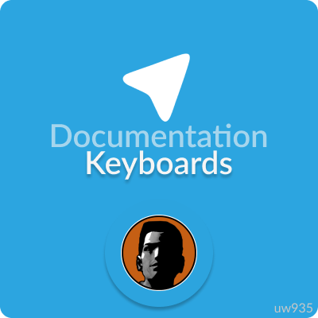

<p align="center">
  
  <h3 align="center">Telegram Sam v1.0.0</h3>
  <p align="center">Simple Multi Theft Auto Lua library for <a href="https://core.telegram.org/bots/api">Telegram Bot API</a><p>
</p>

<br>

## Keyboard functions
## InitKeyboard
This function initialize keyboard and add keyboard to library table.  
### Syntax
```
  number InitKeyboard( string key, string id, [ boolean inline=false ] )
```
### Arguments
+ key: a key from [BotLogin](https://github.com/uw935/mta-telegram-sam/blob/master/docs/docs_main.md#botlogin)</a> table
+ id: unique keyboard id. ID must not match with another keyboard ID
+ inline: true if keyboard inline, false otherwise
### Returns
Returns an index of keyboard in global keyboard table of library
### Examples
This example create inline keyboard and prints it index
```Lua
local keyboard = exports["telegramsam"]:BotSendRequest(Bot.key, "InitKeyboard", "mykeyboard", true)
print(keyboard)
```

<br>

## ReplyKeyboardRemove
This function returns empty keyboard
### Syntax
```
  number ReplyKeyboardRemove( string key, boolean remove_keyboard ) 
```
### Arguments 
+ key: a key from [BotLogin](https://github.com/uw935/mta-telegram-sam/blob/master/docs/docs_main.md#botlogin)</a> table
+ remove_keyboard: true if need to remove keyboard, otherwise false
### Returns 
Returns an special index (-2). That indax means to use "empty keyboard".
### Examples
This example clear user keyboard, just remove it 
```Lua
  function Bot:SendRequest(reqName, ...) 
      return exports["telegramsam"]:BotSendRequest(self.key, reqName, ...)
  end
  
  local function MessageHandler(message)
      Bot:SendRequest("SendMessage", message.chat.id, "Clear keyboard", Bot:SendRequest("ReplyKeyboardRemove", true), true, message.message_id)
  end
  
  addEventHandler("onTelegramNewMessage", root, MessageHandler)
```

<br>

## AddRow
This function add buttons row to keyboard
### Syntax
```
  boolean AddRow( string key, number keyboard_index, table ... )
```
### Arguments
+ key: a key from [BotLogin](https://github.com/uw935/mta-telegram-sam/blob/master/docs/docs_main.md#botlogin)</a> table
+ keyboard_index: keyboard index in global keyboard table of library
+ arguments...: buttons:

If it is an inline keyboard, table format: 
  {{BUTTON_TEXT, CALLBACK_DATA, URL}, {BUTTON_TEXT, CALLBACK_DATA, URL}} -- one row 
  
Otherwise it is a reply keyboard, table format:
  {{BUTTON_TEXT}, {BUTTON_TEXT}} -- one row
### Returns
Returns true if success
### Examples
1. This examples shows how to work with reply keyboard [(full code)](https://github.com/uw935/mta-telegram-sam/tree/master/examples/keyboard/reply_keyboard_bot)
```Lua
function Bot:SendRequest(reqName, ...) -- creating request function
    return exports["telegramsam"]:BotSendRequest(self.key, reqName, ...)
end

local MyKeyboardWith4Buttons = Bot:SendRequest("InitKeyboard", "myKeyboard4but", false)
local MyKeyboardWith2Buttons = Bot:SendRequest("InitKeyboard", "myKeyboard2but", false) -- init reply_keyboard

Bot:SendRequest("AddRow", MyKeyboardWith4Buttons, {{"Button 1"}, {"Button 2"}}) 
Bot:SendRequest("AddRow", MyKeyboardWith4Buttons, {{"Button 3"}, {"Button 4"}}) 
Bot:SendRequest("AddRow", MyKeyboardWith2Buttons, {{"Button 1"}, {"Button 2"}})

local function MessageHandler(message)
    if message.text == "Button 1" or message.text == "Button 3" then 
        Bot:SendRequest("SendMessage", message.chat.id, "Hi!\n\nThis is my keyboard with 2 buttons\nClick to button: ", MyKeyboardWith2Buttons)
        return 
    end

    Bot:SendRequest("SendMessage", message.chat.id, "Hi!\n\nThis is my keyboard with 4 buttons\nClick to button: ", MyKeyboardWith4Buttons)
end

addEventHandler("onTelegramNewMessage", root, MessageHandler)  
```

2. This example shows how to work with inline keyboard [(full code)](https://github.com/uw935/mta-telegram-sam/tree/master/examples/keyboard/inline_keyboard_bot)
```Lua
function Bot:SendRequest(reqName, ...)
    return exports["telegramsam"]:BotSendRequest(self.key, reqName, ...)
end
    

local MyKeyboardWith4Buttons = Bot:SendRequest("InitKeyboard", "myKeyboard4but", true)

Bot:SendRequest("AddRow", MyKeyboardWith4Buttons, {{"Link", "", "https://github.com"}, {"Callback", "myKeyboardCallback"}})  
Bot:SendRequest("AddRow", MyKeyboardWith4Buttons, {{"Delete this message", "keyboardCallbackDeleteMessage"}, {"Button 4", "", "https://google.com/"}})

local function CallbackHandler(cData)
    if cData.callback_data.id == "myKeyboardCallback" then 
        Bot:SendRequest("SendMessage", cData.chat.id, "Hmm.. I think you just click to callback button")
    elseif cData.callback_data.id == "keyboardCallbackDeleteMessage" then
        Bot:SendRequest("DeleteMessage", cData.chat.id, cData.message_id) 
        Bot:SendRequest("SendMessage", cData.chat.id, "Message Deleted!")
    end
end

local function MessageHandler(message) 
    Bot:SendRequest("SendMessage", message.chat.id, "Hi!\n\nThis is my inline keyboard with 4 buttons\nClick them: ", MyKeyboardWith4Buttons)
end

addEventHandler("onTelegramNewMessage", root, MessageHandler)  
addEventHandler("onTelegramCallbackReceive", root, CallbackHandler) 
```

## Other documentation
+ [About keyboard](https://github.com/uw935/mta-telegram-sam/blob/master/docs/docs_keyboards.md)
+ [About functions](https://github.com/uw935/mta-telegram-sam/blob/master/docs/docs_functions.md)
+ [Main documentation](https://github.com/uw935/mta-telegram-sam/blob/master/docs/docs_main.md)

